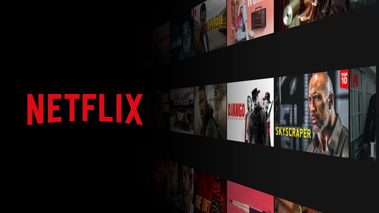
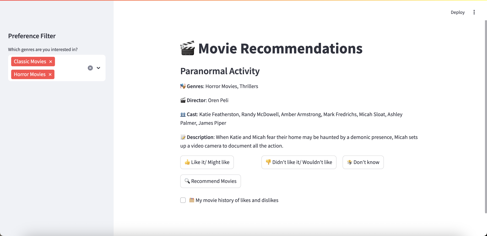

# Movie Recommendations
This is a web-based movie recommendation app built with **Streamlit** and **scikit-learn**, using Netflix's movie data. It allows users to:

- Browse movies one by one
- Mark them as 👍 Liked, 👎 Disliked, or 🤷 Don't Know
- Set their genre preferences
- Receive personalized movie recommendations using machine learning
- 
## How it works
1. **TF-IDF Vectorization**: Movie metadata is converted into numerical vectors.
2. **User Feedback**: You give feedback by liking/disliking/unmarking movies.
3. **Model Training**: A logistic regression model is trained on the labeled data.
4. **Prediction**: The model ranks the remaining movies by how likely you are to like them.
5. **Display**: Top 10 personalized recommendations are shown.

## Example Usage
Select your favorite genres from the sidebar.

Start reviewing movies — click "Like", "Dislike", or "Don't Know".

Once you've given feedback, hit "🔍 Recommend Movies".

View your recommendations based on your taste.

Check your voting history any time.

## Future Plans

I plan to improve and expand the app with the following features:

- ✅ **Feedback on Recommendations**  
  Allow users to rate the recommended movies ("Did you like it?") after watching — this helps measure the recommendation quality and retrain the model for better personalization.

- 🎯 **Smarter Filtering**  
  Add filters for country, year, or actors to fine-tune suggestions.

